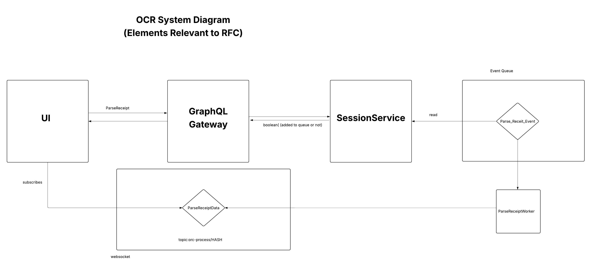

- Start Date: 2026-06-03
- Author: Connor King

## 1. Architecture Overview

The OCR feature lets users upload a receipt photo to auto-populate items, tax, and tip for a bill split session. The image flows through a GraphQL mutation, Redis queue, Gemini API worker, and back to the frontend via WebSocket.

## 2. Features to Be Implemented
1. Receipt Upload and OCR Parsing
 - User Story: Daniel goes out to dinner and receives a receipt with several items, tax, and a tip. Instead of manually entering each item, he uploads a photo of the receipt. The app extracts all items with prices, tax, and tip, and pre-fills the session creation form automatically.
 - Implementation: the frontend sends the receipt image along with a unique hash (UUID) to the backend via a GraphQL multipart mutation. The backend validates the file, serializes it into a Protobuf message, and pushes it onto a Redis queue. A background worker polls the queue, sends the image to Google Gemini with a structured JSON schema requesting items (name, price, count), tax, and tip. The worker then publishes the parsed JSON to a STOMP WebSocket topic keyed by the unique hash. The frontend subscribes to that topic on the creation page and populates the form when results arrive.

## 3. Miscellaneous Considerations
1. Asynchronous processing
 - The GraphQL mutation returns immediately after queuing. The user waits on the creation page for results via WebSocket, decoupling upload from OCR processing time.

2. Error handling
 - If Gemini processing fails, the error is logged server-side