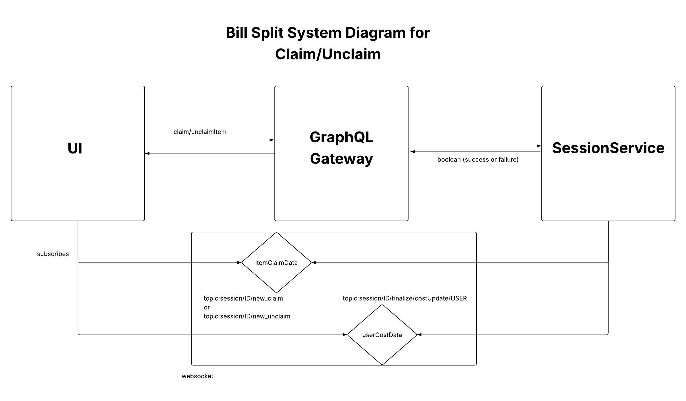

- Start Date: 2026-03-08
- Author: Connor King

## 1. Architecture Overview

This RFC updates the split/finalize plan to match current implementation. Claim and unclaim handling now occurs directly in `SessionService` during GraphQL mutation execution, rather than through an external queue worker. Real-time UI updates are sent through two session topics:
Finalize has been removed from scope due to time and integration constraints.

## 2. Features Implemented / Updated
1. Claim/Unclaim moved into SessionService mutation flow
 - User Story: Daniel claims a shared item and all connected users immediately see who claimed it. If he unclaims it, all users immediately see that reversal.
 - Implementation: `claimItem` and `unclaimItem` are handled synchronously in `SessionService` (no external worker required for this path). After DB state updates, the backend publishes claim/unclaim events to session-scoped WebSocket topics:
	 - Claim topic: `/topic/session/{sessionId}/new_claim`
	 - Unclaim topic: `/topic/session/{sessionId}/new_unclaim`
	 The frontend session page subscribes to both topics and updates `claimedBy` state in real time.

2. Finalize removed from delivery scope
 - User Story: N/A (feature deferred)
 - Implementation: Finalization workflow from the previous plan was dropped because of timeline and integration risk. No finalize mutation/worker/event queue is part of the current backend implementation.